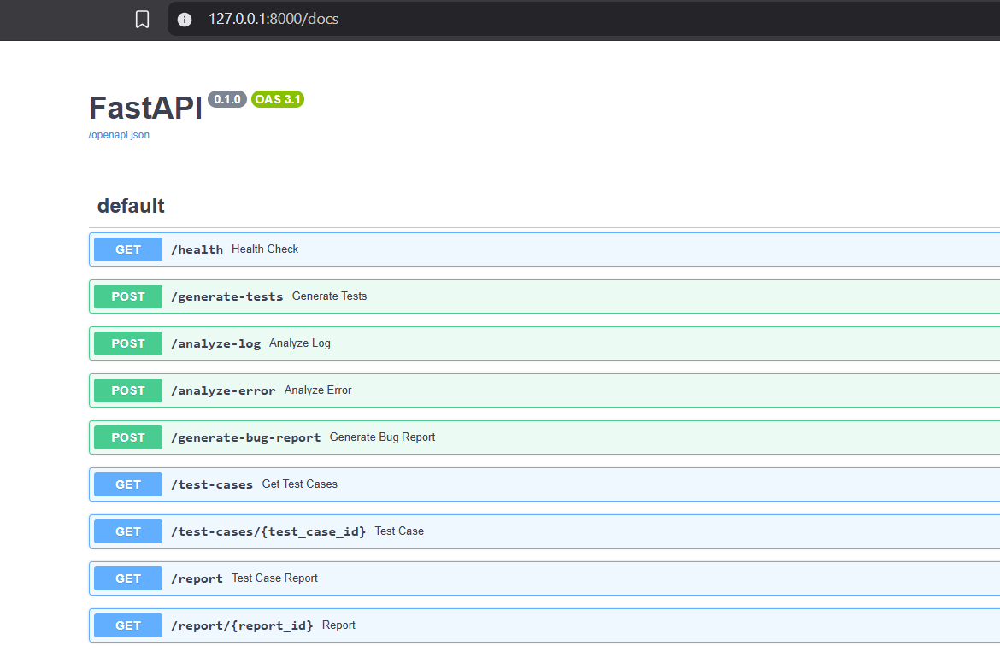
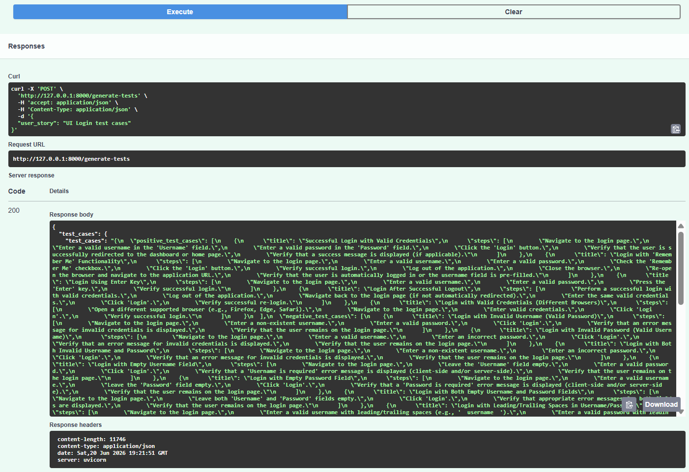
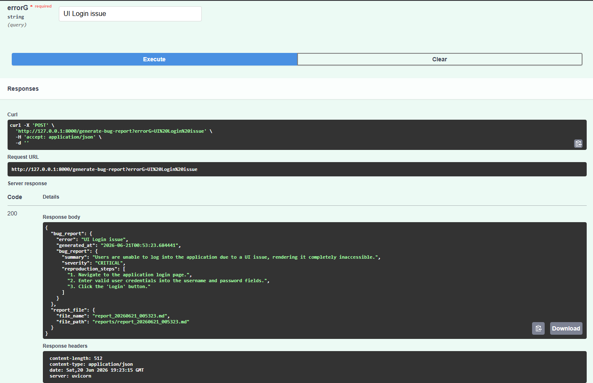
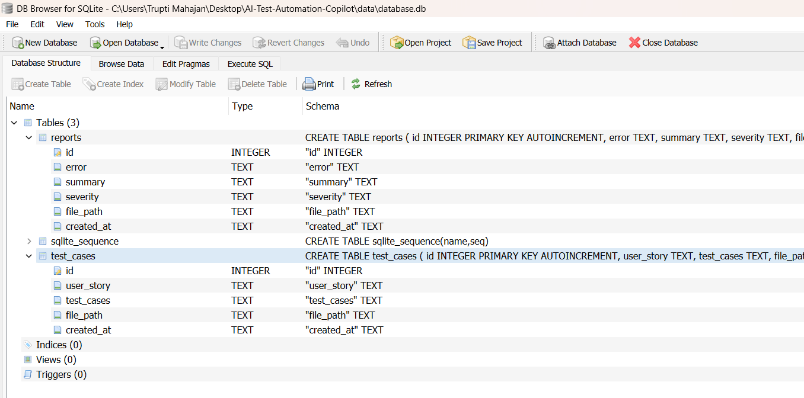
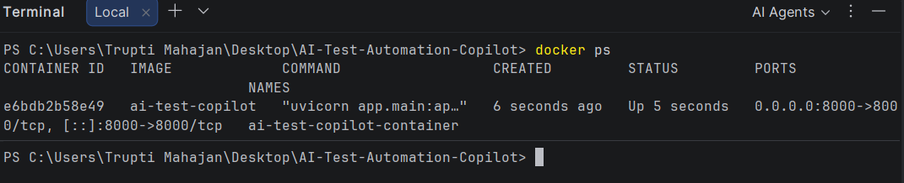
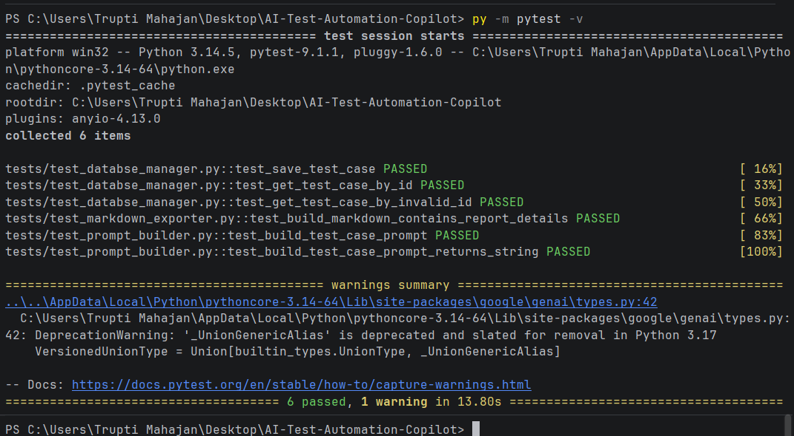

# AI Test Automation Copilot


## Project Overview
AI Test Automation Copilot is an AI-powered testing assistant that generates test cases, analyzes errors, creates bug reports, stores results in SQLite, exposes APIs through FastAPI, and supports Dockerized deployment.
The project demonstrates backend development, API testing concepts, database integration, AI-assisted automation, Docker containerization, and automated testing using Pytest.

## Architecture

```text
User / Swagger UI
        |
        v
      FastAPI
        |
        v
 Business Logic Layer
        |
  ------------------
  |       |        |
  v       v        v
Test    Error    Bug
Case   Analyzer Report
Gen              Gen
  |
  v
Google Gemini API
  |
  v
SQLite Database
```

## Features

- Generate AI-powered test cases from user stories
- Analyze application errors and logs
- Generate structured bug reports
- Export bug reports in Markdown format
- Store test cases and reports in SQLite
- Retrieve stored data through REST APIs
- Interactive API documentation using Swagger UI
- Unit testing using Pytest
- Dockerized deployment
- Modular and scalable architecture

## APIs

### Generate Test Cases

POST /generate-tests

Request:

{
  "user_story": "User should be able to login"
}

Response:

{
  "test_cases": {...},
  "file_path": "generated_tests/login.json"
}

### Generate Bug Report

POST /generate-bug-report

Request:

{
  "error": "Database connection lost"
}

Response:

{
  "error": "Database connection lost",
  "generated_at": "...",
  "bug_report": {...}
}

### Retrieve Test Cases

GET /test-cases

Returns all stored test cases.

### Retrieve Test Case By ID

GET /test-cases/{id}

Returns a specific test case.

### Retrieve Reports

GET /report

Returns all stored reports.

### Retrieve Report By ID

GET /report/{id}

Returns a specific report.

## Tech Stack
### Backend 
- Python
- FastAPI
- Uvicorn

### Database
- SQLite

### AI Integration
- Google Gemini API

### Testing
- Pytest

### Containerization
- Docker

### Data Formats
- JSON
- Markdown

### Version Control
- Git
- GitHub

## Project Structure

AI-Test-Automation-Copilot/

├── app/

│   ├── ai_client.py

│   ├── bug_report_generator.py

│   ├── database_manager.py

│   ├── error_analyzer.py

│   ├── markdown_exporter.py

│   ├── prompt_builder.py

│   ├── test_case_generator.py

│   ├── test_case_storage.py

│   └── main.py

├── tests/

│   ├── test_database_manager.py

│   ├── test_markdown_exporter.py

│   └── test_prompt_builder.py

├── data/

├── generated_tests/

├── reports/

├── Dockerfile

├── requirements.txt

├── pytest.ini

└── README.md

## Setup & Installation

### Clone Repository

git clone https://github.com/truptimahajan01/AI-Test-Automation-Copilot.git
cd AI-Test-Automation-Copilot

### Create Virtual Environment

python -m venv .venv

### Activate Environment

Windows:

.venv\Scripts\activate

### Install Dependencies

pip install -r requirements.txt

### Run Application

uvicorn app.main:app --reload

### Open Swagger UI

http://localhost:8000/docs

## Running with Docker

### Build Docker Image

docker build -t ai-test-copilot .

### Run Container

docker run -p 8000:8000 ai-test-copilot

### Access Application

http://localhost:8000/docs


## Screenshots

### Swagger UI



### Generated Test Cases



### Bug Report Generation



### SQLite Database



### Dockerized Application



### Pytest Results



## Achievements

- Developed AI-powered test case generation system
- Generated structured bug reports using Gemini AI
- Implemented SQLite-based persistence layer
- Built REST APIs using FastAPI
- Added Pytest-based unit testing
- Containerized application using Docker
- Integrated Swagger UI for API documentation

## Future Enhancements

- Support multiple AI providers
- Add authentication and authorization
- Generate PDF reports
- Integrate with Jira
- Add CI/CD pipeline using GitHub Actions
- Support PostgreSQL and MySQL
- Add API rate limiting
- Add Docker Compose support
- Integrate Selenium and Playwright automation
- Deploy to AWS or Azure

## Author
Trupti Mahajan
GitHub: https://github.com/truptimahajan01

